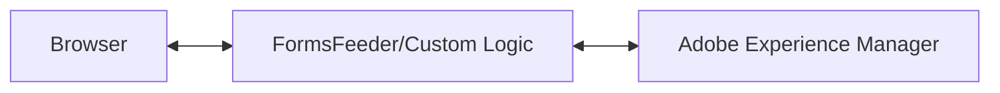
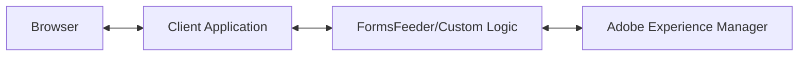

## This project is no longer being maintained.  

The original concept for this was something like a small footprint JEE server but based on Spring Boot and PF4J plugins.  The goal was allow a Java developer to develop a service without having to know how to create REST services and/or understand other frameworks besides FluentForms (for accessing AEM).

It turned out that most developers already know (or should know) how to make a REST service and most developers either know or can learn enough Spring Boot to create one.  This makes this project rather redundant.

### Alternatives

1) Build a Spring Boot service using [FluentForms Spring Boot starter](https://github.com/4PointSolutions/FluentFormsAPI)
2) Use a [JEE-based microprofile](https://microprofile.io/) server like Quarkus, WildFly, Open Liberty, Payara, etc. and the FluentForms cient libraries 

# FormsFeeder
This project provides a microservice that can be customized for individual AEM Forms customers in order to build a complete customer solution that includes an AEM Forms server.  The Forms Feeder service acts as a front-end that wraps (and "feeds") the AEM Forms services with custom code to perform commonly required tasks such as gathering pre-population data, posting submitted data to internal systems, generating documents of record and archiving document data and artifacts.

The framework provides a “plugin” capability to allow each customer to extend the microservice in ways that are specific to that customer’s requirements.

The framework also provides client libraries and client command line interface for invoking the microservice, allowing client applications to access remote AEM Forms functionality through the framework without having to understand the REST protocols that underly that communication.

## Goals of this project
The goals of this project are:

* To provide a common framework for building AEM Forms based solutions.
* To provide a standard interface for invoking custom AEM Forms functionality.
* To remove the need to understand REST in order to invoke custom functionality made available through the framework.
* To provide a shared codebase that is common to many different AEM Forms solutions

## Functionality
FormsFeeder provides the following functionality:
* REST Interface - You don't have to know or understand REST in order to build custom logic into an AEM application.  All you need to know is Java to use the client libraries.  Likewise, you only need to know Java to understand the DataSourceList Java interface to write a plugin.
* Reverse Proxy for HTML5 and Adaptive Forms - Client applications can call FormsFeeder without having to worry about Cross Origin Request Sharing settings.
* Form Submission Processing - FormsFeeder can process AEM Form Submissions without having to open up any services to the internet (even if your AEM instance is somewhere in the cloud).
* Java and XML parsing - FormsFeeder can automatically parse Java and XML into DataSourceList which makes processing of input simpler.

## Architecture
This project consists of several sub-projects with each subproject representing a layer in the architecture (i.e. each layer depends on the layers beneath it).

Here is an overview of the layers:
* _FormsFeeder Server_  – This is the server application that can be used as a front end for AEM (although it can be used for other purposes).  It utilizes a plug-in approach for extensibility.  It is a standalone fat jar.
* _FormsFeeder Client API_  – This API wraps code to make REST calls to the  _FormsFeeder Server_ .  It allows client Java code to make API calls to the  _FormsFeeder Server_  without having to worry about the mechanics of REST.  You include it as a dependency in your Java application.
* _FormsFeeder CLI_  – This is a standalone fat .jar file that can be invoked to send a transaction to the  _FormsFeeder Server_ .  It is an executable jar that reads command line arguments and then uses the  _FormsFeeder Client API_  to make calls to the FormsFeeder server.

Client code that utilizes this project can access whatever layer is appropriate for their needs, for example, a .NET shop might write .NET code that makes REST calls to the  _FormsFeeder Server_  layer directly, bypassing the Java client code.  Likewise a user with Java experience might choose to integrate the  _FormsFeeder Client API_  into an existing Java application without having to learn REST.  Lastly, a user could leverage the entire stack by using the _FormsFeeder CLI_  to invoke FormsFeeder functionality from a CRON job.

## Typical FormsFeeder Topologies 
Typically, FormsFeeder is used in two different topologies:

### FormsFeeder In Front

In this topology FormsFeeder resides between Adobe Experience Manager and the client browser allowing Formsfeeder to invoke custom functionality required by the client. Users interact with the FormsFeeder/Custom Logic layer. FormsFeeder then, in turn, interacts with Adobe Experience Manager.

### Custom Application In Front

In this topology FormsFeeder resides between Adobe Experience Manager and the client application allowing Formsfeeder to invoke custom functionality required by the client application. Users interact with the client application and the client application interacts with the FormsFeeder/Custom Logic layer.
FormsFeeder provides a home for application code and reverse proxies the HTML generated from Adobe (both Adaptive Forms and HTML5).

### Why Reverse Proxy?
#### Pros:
* Prevents Cross Origin Requests
* Allows for relative links
* Layered Architecture

#### Cons:
* Introduces some latency 
* Must be implemented in client application in Scenario 2 
* Sensitive to changes in Adobe Experience Manager HTML generation (mainly Adaptive Form code changes).

### Why Custom Application Code in the middle?
* Provides a translation layer from client semantics to Adobe Experience Manager semantics
* Encapsulates and isolates the translation logic for easy maintenance
* Can reside inside the firewall to interact with internal services
* Loosely coupled with Adobe Experience Manager
* Can use technologies other than those supported by Adobe Experience Manager 
* Can be upgraded separately from Adobe Experience Manager 
  * Likewise Adobe Experience Manager can be upgraded separately without affecting it or the client applications
* Can do things server-side instead of client-side
  * Server-side can perform "trusted" operations that client-side cannot
